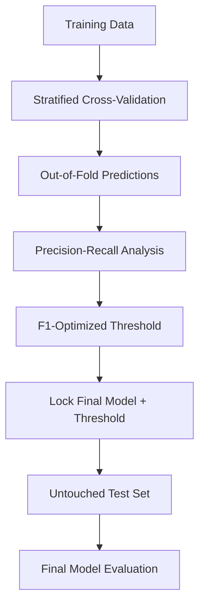

# Credit Card Fraud Detection Using Machine Learning
## 1. Project Overview
This project develops and evaluates machine learning models for detecting fraudulent credit card transactions. The main challenge is the severe class imbalance in the dataset, where fraudulent transactions represent only a very small proportion of all transactions.


The project focuses on comparing different machine learning approaches, investigating techniques for handling class imbalance, and evaluating model performance using metrics that are appropriate for fraud detection.

## 2. Dataset
The dataset used in this project is the Credit Card Fraud Detection dataset provided through Kaggle.

Source: https://www.kaggle.com/datasets/mlg-ulb/creditcardfraud

The dataset contains:

284,807 transactions
31 variables
492 fraudulent transactions
284,315 legitimate transactions
Fraudulent transactions represent approximately 0.172% of all transactions.

### Dataset Availability

The raw and cleaned datasets are not included in this GitHub repository.

This avoids storing large copies of a dataset that is already publicly available through Kaggle.

To reproduce the project:
Download creditcard.csv from the Kaggle source above.

## 3. Baseline Models

Three models were evaluated during the baseline modelling stage:

* Logistic Regression
* Random Forest
* XGBoost

These models provide a progression from a relatively interpretable linear classifier to more flexible tree-based ensemble methods.

Logistic Regression used feature standardization because its optimization and coefficients are sensitive to feature scale. Random Forest and XGBoost are tree-based models and therefore did not require feature standardization.

The baseline models produced the following results:

| Model               | Accuracy |  Precision |     Recall |   F1-score | ROC-AUC |     PR-AUC |
| ------------------- | -------: | ---------: | ---------: | ---------: | ------: | ---------: |
| XGBoost             |   0.9995 |     0.9571 |     0.7053 |     0.8121 |  0.9730 | **0.8032** |
| Random Forest       |   0.9995 | **0.9718** | **0.7263** | **0.8313** |  0.9284 |     0.7973 |
| Logistic Regression |   0.9991 |     0.8462 |     0.5789 |     0.6875 |  0.9560 |     0.6920 |

Although all three models achieved accuracy above 99.9%, this does **not** mean that they performed equally well.

Because approximately 99.8% of transactions are legitimate, a model can achieve extremely high accuracy while still performing poorly at identifying the minority fraud class. Therefore, accuracy was not used as the primary model-selection criterion.

**PR-AUC / Average Precision** was emphasized because it provides a more informative assessment of minority-class ranking performance under severe class imbalance.

At baseline, XGBoost achieved the highest PR-AUC at **0.8032**, while Random Forest achieved slightly stronger threshold-dependent Precision, Recall, and F1-score.


## 4. Class Imbalance Handling

Fraudulent transactions represent only approximately **0.172%** of the original dataset, creating a severe class-imbalance problem.

Several approaches were evaluated:

* Logistic Regression with class weighting
* Logistic Regression with random undersampling
* Logistic Regression with SMOTE
* Random Forest with class weighting
* XGBoost with imbalance weighting using `scale_pos_weight`

The imbalance-handling approaches were evaluated using **stratified cross-validation on the training data**. Resampling was kept within the training workflow so that the protected test set did not influence model development.

The following cross-validated results were obtained:

| Approach                            |     PR-AUC |    ROC-AUC |         F1 |     Recall |  Precision |
| ----------------------------------- | ---------: | ---------: | ---------: | ---------: | ---------: |
| **XGBoost — imbalance weight**      | **0.8501** | **0.9781** |     0.8381 |     0.8459 |     0.8331 |
| Random Forest — class weight        |     0.8399 |     0.9548 | **0.8392** |     0.7544 | **0.9481** |
| Logistic Regression — SMOTE         |     0.7455 |     0.9697 |     0.1103 |     0.8982 |     0.0588 |
| Logistic Regression — class weight  |     0.7451 |     0.9741 |     0.1166 |     0.8956 |     0.0624 |
| Logistic Regression — undersampling |     0.5876 |     0.9761 |     0.0687 | **0.9139** |     0.0357 |

**XGBoost with imbalance weighting achieved the highest PR-AUC of 0.8501**, providing the strongest ranking performance among the evaluated approaches.

Random Forest with class weighting also performed strongly and achieved particularly high precision.

The Logistic Regression imbalance-handling approaches produced high recall but extremely low precision. This means that they successfully detected many fraudulent transactions but also incorrectly classified many legitimate transactions as fraud.

This demonstrates an important practical trade-off in fraud detection:

> Is it more costly to miss a fraudulent transaction, or to investigate a legitimate transaction that has been incorrectly flagged as fraud?

A useful fraud detection system therefore cannot be selected by maximizing recall alone. The operational costs of both false negatives and false positives must be considered.

Based on the cross-validation results, **XGBoost and Random Forest were selected for further hyperparameter tuning**.

## 5. Model Tuning and Final Model Selection

Only XGBoost and Random Forest were carried forward to the tuning stage because they were the two strongest candidates during the class-imbalance experiments.

Hyperparameter tuning was performed using `RandomizedSearchCV` with stratified cross-validation, using **Average Precision / PR-AUC** as the optimization metric.

The best cross-validation results were:

| Model         | Best CV PR-AUC |
| ------------- | -------------: |
| **XGBoost**   |     **0.8502** |
| Random Forest |         0.8324 |

### Best Random Forest Parameters

| Hyperparameter      | Selected Value |
| ------------------- | -------------: |
| `n_estimators`      |            300 |
| `max_depth`         |             14 |
| `min_samples_split` |              2 |
| `min_samples_leaf`  |              4 |
| `max_features`      |         `sqrt` |

### Best XGBoost Parameters

| Hyperparameter     | Selected Value |
| ------------------ | -------------: |
| `n_estimators`     |            300 |
| `max_depth`        |              5 |
| `learning_rate`    |            0.1 |
| `min_child_weight` |              5 |
| `subsample`        |            0.8 |
| `colsample_bytree` |            0.8 |

XGBoost achieved the highest cross-validated PR-AUC and was therefore selected as the final model.

It is important not to overstate the effect of tuning. XGBoost achieved a PR-AUC of approximately **0.8501 before tuning** and **0.8502 after tuning**.

The improvement was therefore marginal. This suggests that most of the performance gain came from selecting an appropriate model and handling the severe class imbalance rather than from extensive hyperparameter optimization.

### Classification Threshold Selection

The final model produces fraud probabilities, but a probability must be converted into a fraud/legitimate decision.

Instead of automatically relying on the default threshold of `0.5`, out-of-fold predicted probabilities were generated from the training data using stratified cross-validation.

The precision-recall curve was then evaluated across candidate thresholds, and the threshold that maximized the validation F1-score was selected.

The test set was not used to select this threshold.



This protects the final test set from influencing model or threshold selection.

---

## 6. Key Findings and Final Test Results

After model selection, tuning, and threshold optimization were completed, the final XGBoost model was evaluated on the **untouched test set**.

### Final Test Performance

| Metric    | Final Test Result |
| --------- | ----------------: |
| PR-AUC    |        **0.8277** |
| ROC-AUC   |        **0.9712** |
| Precision |        **0.9867** |
| Recall    |        **0.7789** |
| F1-score  |        **0.8706** |

The final model achieved a **PR-AUC of 0.8277**, indicating strong minority-class ranking performance on unseen test data.

The **ROC-AUC of 0.9712** indicates strong overall discrimination between fraudulent and legitimate transactions.

The model achieved **precision of 0.9867**, meaning approximately 98.7% of transactions classified as fraud were actually fraudulent in the test set.

Recall was **0.7789**, meaning approximately 77.9% of actual fraudulent transactions were successfully detected. Conversely, approximately **22.1% of fraud cases were missed**.

The resulting **F1-score of 0.8706** reflects the balance between the model's extremely high precision and comparatively lower recall.

### Practical Interpretation

The final model is relatively **precision-oriented**.

This means that when the model generates a fraud alert, the alert is highly reliable. Such behaviour can reduce unnecessary investigations and minimize disruption to legitimate customers.

However, the lower recall means that some fraudulent transactions remain undetected.

The two errors have different business consequences:

* **False positive:** A legitimate transaction is incorrectly flagged as fraud, potentially causing unnecessary investigation or customer inconvenience.
* **False negative:** A fraudulent transaction is classified as legitimate, potentially resulting in direct financial loss.

The F1-optimized threshold provides a transparent statistical compromise for this project. In a real financial institution, however, the optimal threshold should ideally be based on the financial and operational costs associated with these two types of error.

---

## 7. FastAPI Model Deployment and Limitations

### FastAPI Deployment

To demonstrate how the trained machine learning model can be used outside the Jupyter Notebook environment, the final XGBoost model is exposed through a **FastAPI REST API**.

The trained model and selected classification threshold are stored as reusable model artifacts:

```text
Models/
├── xgboost_best.pkl
└── xgboost_threshold.pkl
```

The API loads these saved artifacts when the application starts.

It does **not retrain the model** when a prediction request is received. Its purpose is model inference.

### API Workflow

```text
Transaction Features
        ↓
POST /predict
        ↓
FastAPI
        ↓
Saved XGBoost Model
        ↓
Fraud Probability
        ↓
Saved Classification Threshold
        ↓
Fraud / Legitimate Prediction
        ↓
JSON Response
```

### Running the API Locally

From the project root, run:

```bash
python -m uvicorn api.main:app --reload
```

Once the server is running, the interactive API documentation can be accessed at:

```text
http://127.0.0.1:8000/docs
```

### `GET /`

The root endpoint provides a simple check that the API is running.

Example response:

```json
{
  "message": "Credit Card Fraud Detection API"
}
```

### `POST /predict`

The prediction endpoint accepts the 30 transaction predictors used by the model:

* `Time`
* `V1`–`V28`
* `Amount`

The API validates the incoming transaction, converts it into the model's expected input structure, calculates the fraud probability, applies the saved classification threshold, and returns the prediction.

Example response:

```json
{
  "fraud_probability": 0.91,
  "prediction": 1,
  "label": "Fraud"
}
```

where:

* `fraud_probability` is the model's fraud score/probability.
* `prediction = 0` represents a legitimate transaction.
* `prediction = 1` represents a fraudulent transaction.
* `label` provides a human-readable result.

The API applies the classification threshold selected during final model development rather than automatically reverting to the default threshold of `0.5`.

### Limitations

#### Anonymized Features

The dataset contains 28 PCA-transformed and anonymized features (`V1`–`V28`). Their original business meanings are unavailable.

This limits direct interpretation of why a particular transformed feature contributes to fraud prediction.

#### API Input Limitation

A normal end user cannot realistically provide `V1`–`V28` manually because these values are transformed features rather than ordinary transaction information.

The FastAPI application should therefore be viewed primarily as a **technical demonstration of model serving and inference**, rather than a production-ready customer-facing fraud detection application.

In a real banking environment, raw transaction information would first pass through an upstream data-processing and feature-engineering pipeline that generates the variables required by the model.

#### Dataset Representativeness

The model was developed using a specific historical credit card transaction dataset.

Fraud behaviour can change over time, and patterns learned from this dataset may not generalize perfectly to different financial institutions, populations, countries, or future transaction patterns.

#### Classification Threshold

The classification threshold was selected by maximizing validation F1-score.

Although this provides a transparent statistical criterion, a real fraud detection system should ideally select its threshold using business costs, including:

* Financial losses from undetected fraud
* Cost of investigating false alerts
* Customer inconvenience caused by false positives
* Fraud investigation capacity
* Organizational risk tolerance

#### Production Deployment

The FastAPI application demonstrates local model deployment but is **not a complete production banking system**.

A production implementation would require additional components such as authentication, security controls, request logging, automated testing, monitoring, model versioning, drift detection, infrastructure deployment, and potentially automated retraining.

---

## 8. Conclusion

This project demonstrates an end-to-end machine learning workflow for credit card fraud detection under **extreme class imbalance**.

Three machine learning models—Logistic Regression, Random Forest, and XGBoost—were initially compared. Additional experiments investigated class weighting, random undersampling, SMOTE, and XGBoost-specific imbalance weighting.

Among the evaluated approaches, **XGBoost with imbalance weighting produced the strongest PR-AUC performance** and was subsequently selected for hyperparameter tuning and final model development.

Hyperparameter tuning produced only a marginal improvement in cross-validated PR-AUC, from approximately **0.8501 to 0.8502**. This is an important result because it demonstrates that extensive tuning does not necessarily produce substantial improvements when the model and imbalance-handling strategy are already well chosen.

On the untouched test set, the final model achieved:

* **PR-AUC:** 0.8277
* **ROC-AUC:** 0.9712
* **Precision:** 0.9867
* **Recall:** 0.7789
* **F1-score:** 0.8706

The final model produced highly reliable fraud alerts, as demonstrated by its very high precision, but still failed to identify approximately 22.1% of fraudulent transactions.

This illustrates a central challenge in real-world fraud detection: there is no universally optimal balance between precision and recall. The preferred decision threshold depends on the relative financial and operational costs of false positives and false negatives.

Finally, the FastAPI implementation demonstrates how the trained XGBoost model and selected classification threshold can be separated from the model-development environment and exposed through a reusable prediction interface.

Overall, the project demonstrates the importance of **imbalance-aware evaluation, careful model validation, appropriate model selection, threshold optimization, and separation between model development and inference** when developing machine learning systems for fraud detection.

